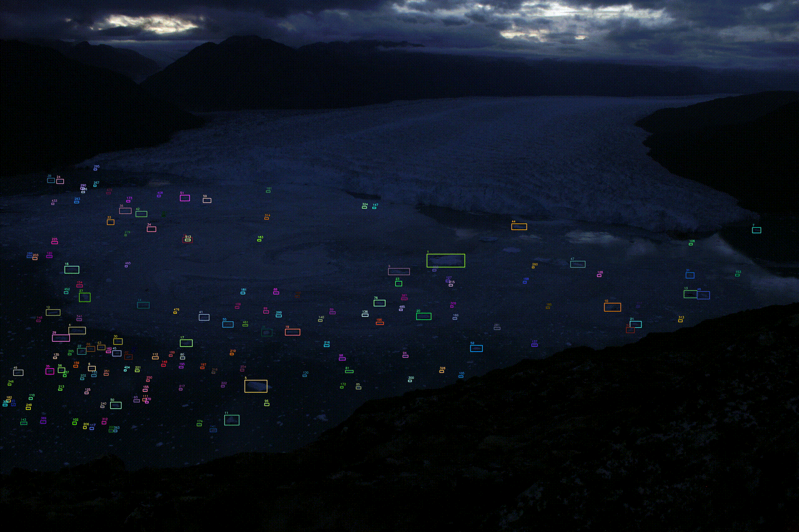
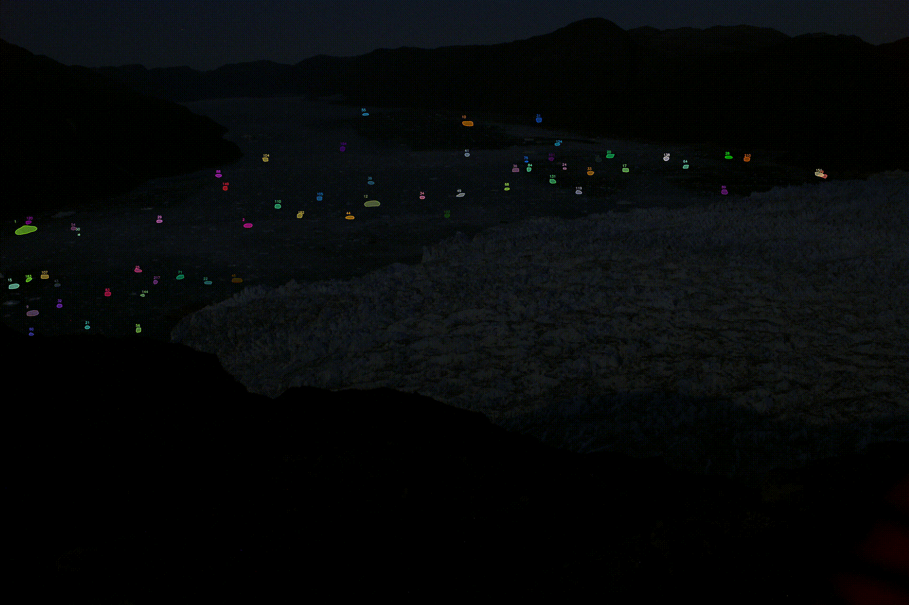

# Iceberg Tracking

This repository provides the implementation of detecting and tracking icebergs in timelapse images captured during field observations.


<div align="center">
    
    
</div>
<div align="center">
    
    
</div>


### Glacier
- name: Equalorutsit Kangiliit Sermiat OR Qajuuttap Sermia 
- 3km wide calving front
- ice ~50-80m high at calving front
- coordinates: [61.332, -45.780](https://www.google.de/maps/place/61%C2%B019'55.2%22N+45%C2%B046'48.0%22W/@61.3045198,-45.8038482,7726m/data=!3m1!1e3!4m4!3m3!8m2!3d61.332!4d-45.78!5m1!1e4?entry=ttu&g_ep=EgoyMDI1MDIyNi4xIKXMDSoJLDEwMjExNDUzSAFQAw%3D%3D)

## Getting Started

### Installation

```bash
git clone https://github.com/mj-support/iceberg-tracking.git
cd iceberg-tracking
conda env create -f environment.yml
conda activate iceberg-tracking
```

### Preparation

1. Create a directory with the name of your dataset in: ``data/``
2. Store the images in: ``data/<dataset_name>/images/raw/``
3. Create a ground truth dataset with annotated detections that follows the MOT format and store the file in: ``data/<dataset_name>/annotations/gt.txt``
   - Each line represents one object instance, containing ten comma-separated values:
     ```
     <frame>, <id>, <bb_left>, <bb_top>, <bb_width>, <bb_height>, <conf>, <x>, <y>, <z>
     ```
   - For more information see [MOT Challenge](https://motchallenge.net/instructions/).

For detailed preparation and usage instruction see [docs](docs/tracking-pipeline.ipynb)

## Basic Usage

```python
from embedding import IcebergEmbeddingsConfig, IcebergEmbeddingsTrainer
from detection import IcebergDetectionConfig, IcebergDetector
from tracking import IcebergTrackingConfig, IcebergTracker
from utils.feature_extraction import get_gt_thresholds
from utils.visualize import Visualizer

# Dataset configuration
dataset = "hill_2min_2023-08"
image_format = "JPG"

# Learning and generating embeddings that capture iceberg appearance similarity
embedding_config = IcebergEmbeddingsConfig(dataset, image_format)
trainer = IcebergEmbeddingsTrainer(embedding_config)
trainer.run_complete_pipeline()

# Train a Faster R-CNN model to detect icebergs in timelapse images
detection_config = IcebergDetectionConfig(dataset, image_format)
detector = IcebergDetector(detection_config)
detector.train()
detector.predict()

# Match and track the detected icebergs based on appearance and size similarity and distance
thresholds = get_gt_thresholds(dataset, image_format)
tracking_config = IcebergTrackingConfig(dataset, image_format, thresholds=thresholds)
tracker = IcebergTracker(tracking_config)
tracker.track()

# Visualize the tracking results
visualizer = Visualizer(dataset, image_format, annotation_source="tracking")
visualizer.annotate_icebergs(draw_ids=True, draw_boxes=True, draw_contours=True, draw_masks=True)
```